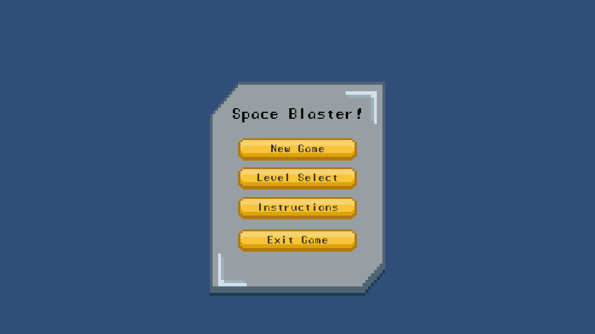
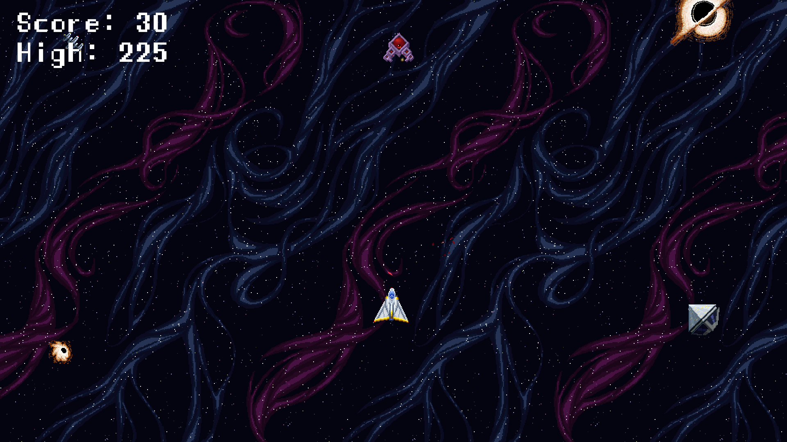
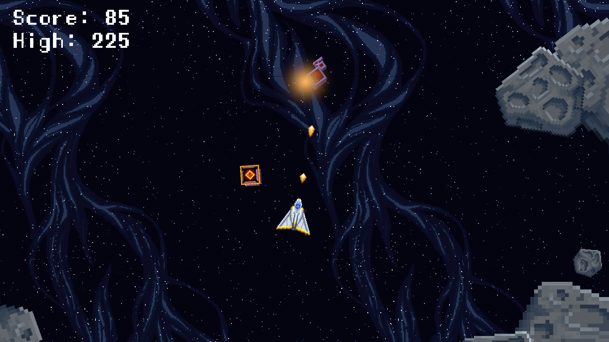
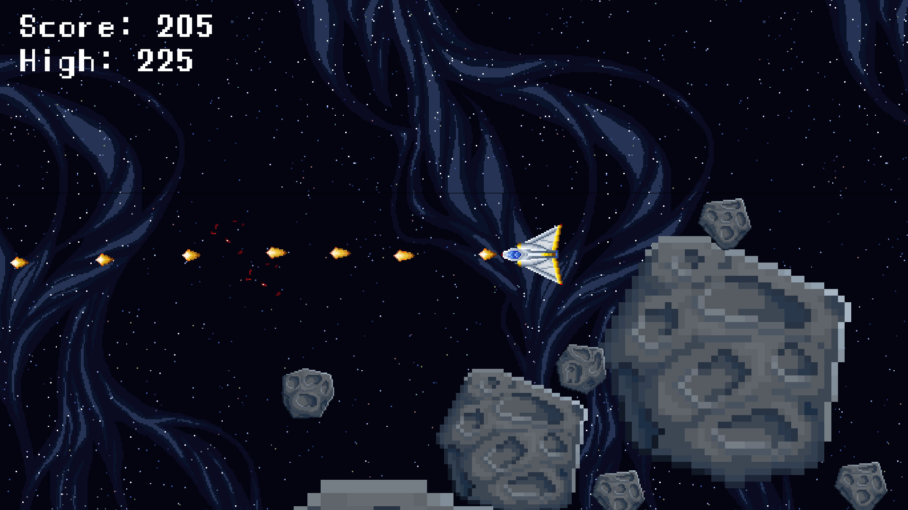

# 🎮 2D Shooter

A fast-paced arcade-style 2D shooting game where your reflexes matter. Blast enemies, dodge bullets, and survive waves of relentless action!

🔗 [Play 2D Shooter on Itch.io](https://taniksha-sh.itch.io/2d-shooter)

🔗 [Play 2D Shooter 2 on Itch.io](https://taniksha-sh.itch.io/2d-shooter-2)

---

## 🕹️ Gameplay

* **Genre**: Arcade / Shooter
* **Controls**:

  * Move: Arrow keys / WASD
  * Shoot: Spacebar / Left Click
* **Objective**: Eliminate enemies and survive as long as possible.

Enemies will come at you from different directions. Your mission is to shoot them down while dodging incoming attacks. The longer you survive, the higher your score!

---

## 🚀 Features

* Responsive and smooth 2D controls
* Increasing difficulty with time
* Retro-style sound effects
* Minimalistic and immersive design
* Works directly in browser – no installation needed

---

## 📷 Screenshots

---

## 🛠️ Tech Stack

* Engine: Unity
* Language: C#
* Platform: WebGL Build
* Developed by: [Taniksha Shah](https://taniksha-sh.itch.io)

---

## 📢 Feedback & Support

If you enjoyed the game or have suggestions/bugs to report, feel free to leave a comment on the [Itch.io page](https://taniksha-sh.itch.io/2d-shooter-2) or reach out via social platforms linked on the page.

---

## 📄 License

This project is for educational and portfolio purposes and built while following a game development course.

---